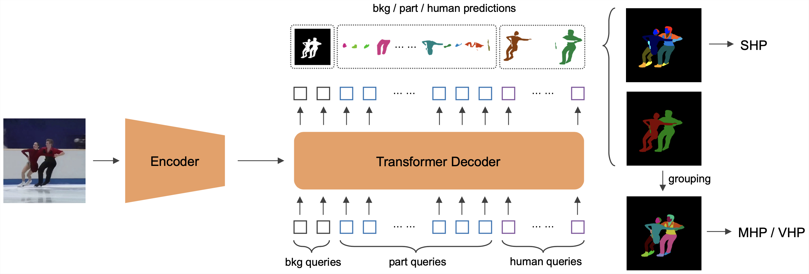
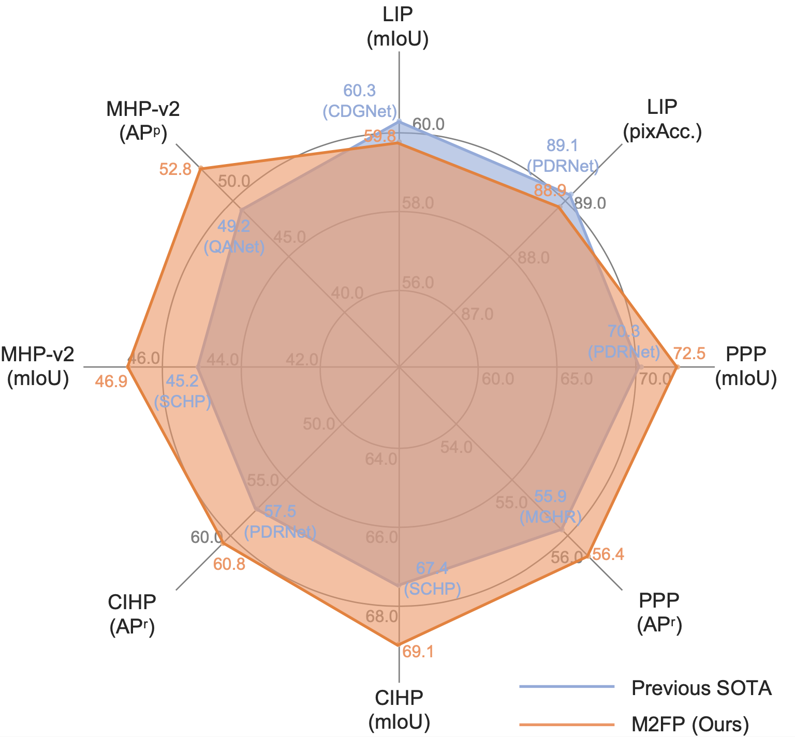

# M2FP: Mask2Former for Parsing

> [Deep Learning Technique for Human Parsing: A Survey and Outlook]() <br>
> [](https://arxiv.org/pdf/2301.00394.pdf)

<p align="center"></p>


If you find this repository helpful, please consider citing:

```BibTeX
@article{yang2023humanparsing,
  title={Deep Learning Technique for Human Parsing: A Survey and Outlook},
  author={Lu Yang and Wenhe Jia and Shan Li and Qing Song},
  journal={arXiv preprint arXiv:2301.00394},
  year={2023}
}
```


### Features
* A single architecture for single human parsing, and multiple (instance-level) human parsing.
* Support several parsing datasets: LIP, PASCAL-Person-Part, CIHP, MHP-v2.


## Updates
[2023/1/19] models in GoogleDrive are released.

[2023/1/3] paper and code released.

[2022/6/19] code initialization.


## Installation

See [installation instructions](INSTALL.md).


## Getting Started

See [Preparing Datasets for M2FP](datasets/README.md).

See [Getting Started with M2FP](GETTING_STARTED.md).


## Results and Models

|  Datasets         | mIoU  |  APr  |  APp  | DOWNLOAD |
|:-----------------:|:-----:|:-----:|:-----:| :-------:|
| LIP               | 59.86 |       |       | [BaiduCloud (passwd: 36ec)](https://pan.baidu.com/s/1ah-0RJ_BdPjLqklWmcoiFA), [GoogleDrive](https://drive.google.com/drive/folders/1lSRMJy_g5Q7FsH4dlahST9bIgNusMuCR?usp=share_link)        |
| PASCAL-Person-Part| 72.54 | 56.46 |       |          |
| CIHP              | 69.15 | 60.47 |       | [BaiduCloud (passwd: jzrn)](https://pan.baidu.com/s/1oquw4pujHdkCEPtUHFyG7g), [GoogleDrive](https://drive.google.com/drive/folders/1UCyo2c1zJqncItyydC64PE78KaX0iR2F?usp=share_link)          |
| MHP-v2            | 47.64 |       | 53.36 | [BaiduCloud (passwd: seel)](https://pan.baidu.com/s/17S-932D-bs1VlU3MANge9A), [GoogleDrive](https://drive.google.com/drive/folders/1i-OFPzPRfRQ3prCtC60gmq5h-Ke1vo9o?usp=share_link)      |


<p align="center"></p>


## License

Shield: [![CC BY-NC 4.0][cc-by-nc-shield]][cc-by-nc]

The majority of M2FP is licensed under a
[Creative Commons Attribution-NonCommercial 4.0 International License](LICENSE).

[![CC BY-NC 4.0][cc-by-nc-image]][cc-by-nc]

[cc-by-nc]: http://creativecommons.org/licenses/by-nc/4.0/
[cc-by-nc-image]: https://licensebuttons.net/l/by-nc/4.0/88x31.png
[cc-by-nc-shield]: https://img.shields.io/badge/License-CC%20BY--NC%204.0-lightgrey.svg


## <a name="CitingM2FP"></a>Citing MaskFormer and Mask2Former

If you find the code useful, please also consider the following MaskFormer and Mask2Former BibTeX entry.

```BibTeX
@inproceedings{cheng2021mask2former,
  title={Masked-attention Mask Transformer for Universal Image Segmentation},
  author={Bowen Cheng and Ishan Misra and Alexander G. Schwing and Alexander Kirillov and Rohit Girdhar},
  journal={CVPR},
  year={2021}
}
```

```BibTeX
@inproceedings{cheng2021maskformer,
  title={Per-Pixel Classification is Not All You Need for Semantic Segmentation},
  author={Bowen Cheng and Alexander G. Schwing and Alexander Kirillov},
  journal={NeurIPS},
  year={2021}
}
```

## Acknowledgement

Code is largely based on Mask2Former (https://github.com/facebookresearch/Mask2Former).
